# 「吃了没」原型图说明

> 本原型为**高保真原型**：直接截取自可运行的「吃了没」App（手机宽度 390px 预览），覆盖完整下单闭环与核心个性化功能。
>
> 对应需求文档见 [PRD.md](./PRD.md)，线上可体验地址：<https://Musaen.github.io/chilemei/>

---

## 页面总览

| 序号 | 页面 | 说明 |
| --- | --- | --- |
| 01 | 首页 | 搜索、时段推荐、猜你喜欢、分类、附近好店 |
| 02 | 店铺详情 | 菜单、标签、加购、拉黑、忌口栏 |
| 03 | 购物车抽屉 | 已选商品、修改数量、清空 |
| 04 | 结算页 | 地址、商品、备注、价格明细 |
| 05 | 支付页 | 支付方式、确认支付 |
| 06 | 支付成功 | 成功动画、进入配送跟踪 |
| 07-08 | 配送跟踪 | 时间轴、模拟地图、ETA 倒计时、超时必赔 |
| 09 | 订单列表 | 历史订单、再来一单 |
| 10 | 订单详情 | 状态、商品、金额、地址、备注 |
| 11 | 我的页 | 昵称、统计、菜单、主题色 |
| 12 | 地址管理 | 列表、新增、删除 |
| 13 | 已拉黑店铺 | 拉黑管理、取消拉黑 |
| 14-15 | 忌口 | 选择面板、菜单过滤效果 |
| 16 | 主题色 | 切换后的全站配色效果 |

---

## 01 首页

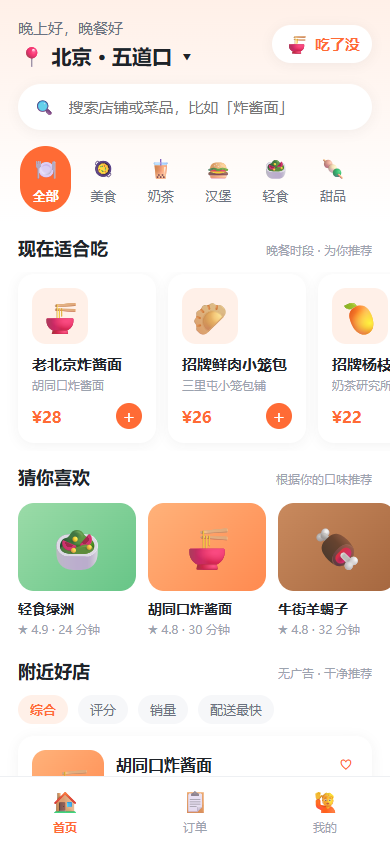

- 顶部问候 + 定位（北京·五道口）+ 品牌标识；
- 搜索框支持店铺名/菜品名/标签搜索；
- 「现在适合吃」按时段推荐，命中「这一顿忌口」的自动过滤；
- 「猜你喜欢」按历史订单品类加权 + 收藏优先；
- 分类金刚区 + 附近好店（综合/评分/销量/配送最快排序）；
- 底部 Tab：首页 / 订单 / 我的。

## 02 店铺详情

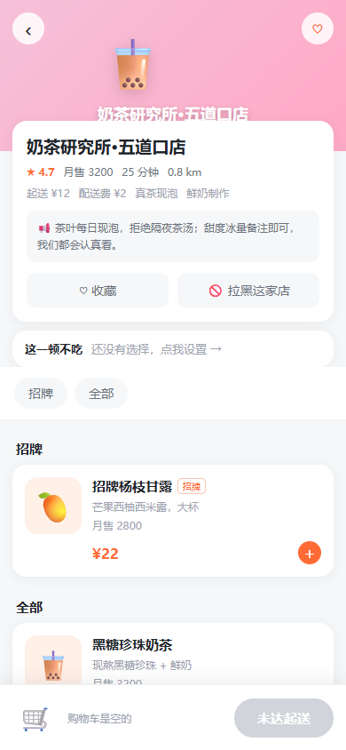

- 渐变横幅 + 店铺信息卡（评分、月售、配送费、起送、公告）；
- 操作区：收藏 / 拉黑这家店（拉黑后首页不再推荐）；
- 「这一顿不吃」忌口栏：设置后菜单自动过滤；
- 菜单按招牌/全部分组，支持标签、原价划线、售罄置灰。

## 03 购物车抽屉

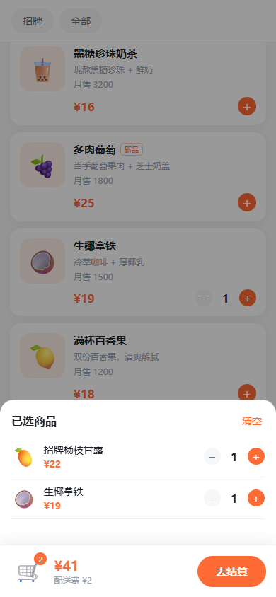

- 底部购物车栏显示数量与合计，未达起送时按钮禁用并提示差额；
- 展开抽屉可修改数量、清空（二次确认）。

## 04 结算页

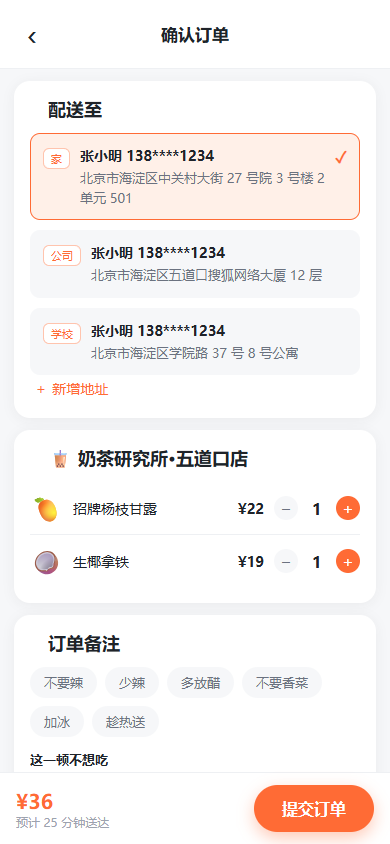

- 配送地址单选 + 新增地址；
- 商品明细可改数量；备注支持快捷 chips + 自定义；
- 「这一顿不想吃」可再调整，自动写入备注；
- 价格明细全透明：小计 / 配送费 / 新人立减 / 满 30 免配送费 / 合计，标注「无隐藏费用」。

## 05-06 支付

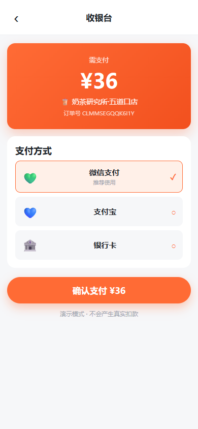
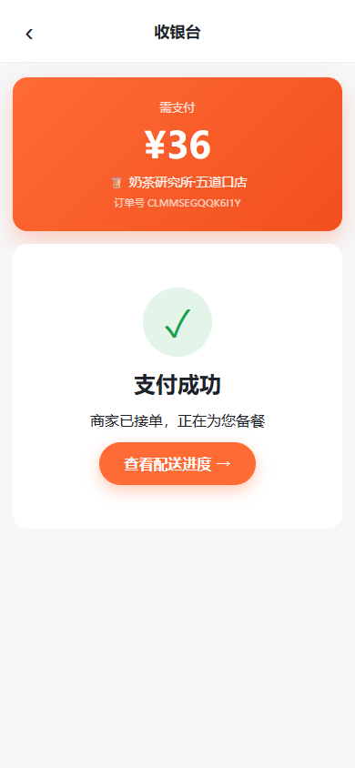

- 微信 / 支付宝 / 银行卡三种演示支付方式；
- 确认支付 → 转圈 → 成功动画 → 进入配送跟踪；
- 明示「演示模式 · 不会产生真实扣款」。

## 07-08 配送跟踪

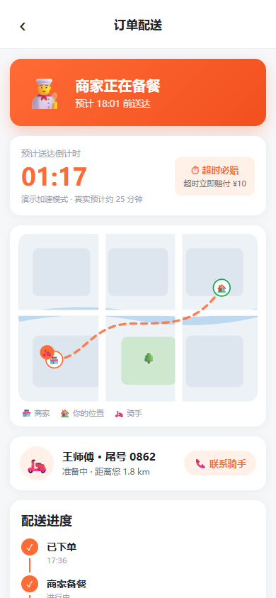
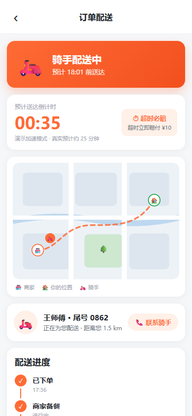

- 状态时间轴：已下单 → 商家备餐 → 骑手取餐 → 配送中 → 已送达；
- SVG 模拟地图：骑手沿路线移动、商家与目的地标记；
- ETA 大字倒计时 + 真实预计时长 + 「超时必赔 ¥10」承诺；
- 骑手卡片（演示拨号）、订单摘要、准时必达/超时必赔/食材安心保障条；
- 刷新后按时间戳恢复进度。

## 09-10 订单

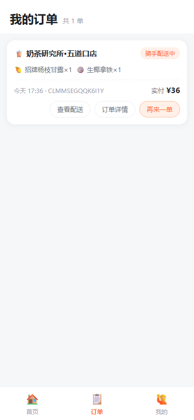
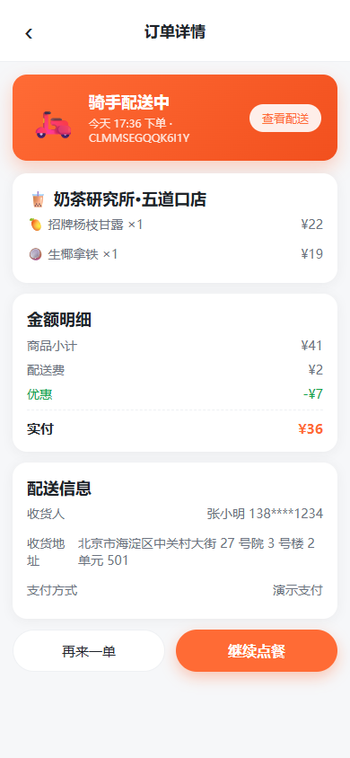

- 列表：店铺、状态、时间、实付，支持查看配送 / 详情 / 再来一单；
- 详情：状态、商品、金额明细、收货信息、备注（含忌口）。

## 11 我的页

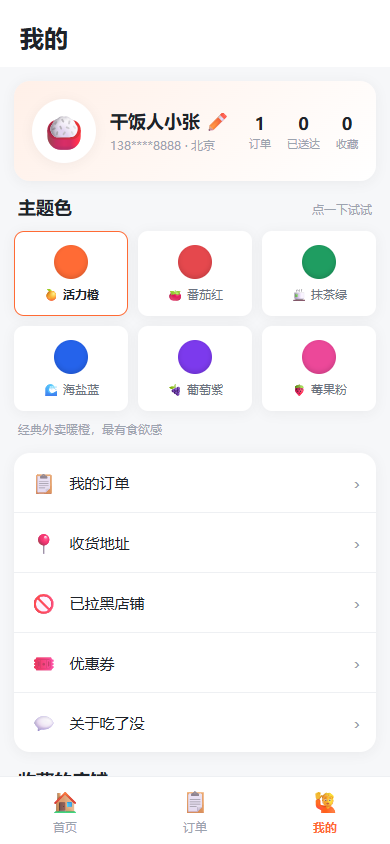

- 头像 + 昵称编辑 + 统计（订单/已送达/收藏）；
- 菜单：我的订单、收货地址、已拉黑店铺（带数量）、优惠券（演示）、关于吃了没；
- 主题色专区：6 套方案实时切换、刷新保持；
- 收藏店铺列表。

## 12 地址管理

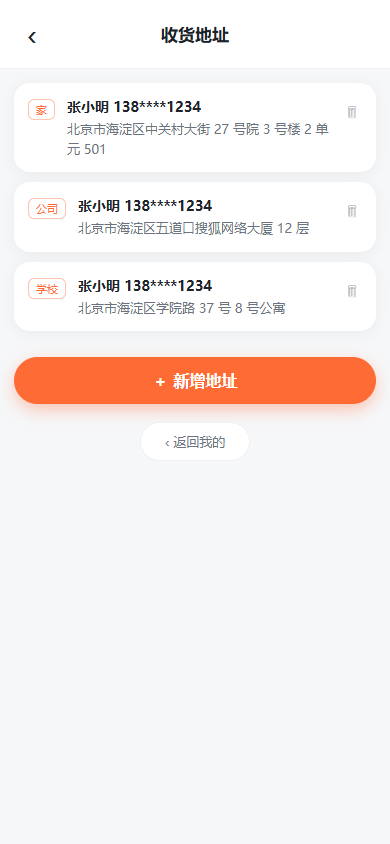

- 地址列表（家/公司/学校标签）；
- 新增表单（姓名/电话/详细地址/标签）；
- 删除前二次确认。

## 13 已拉黑店铺

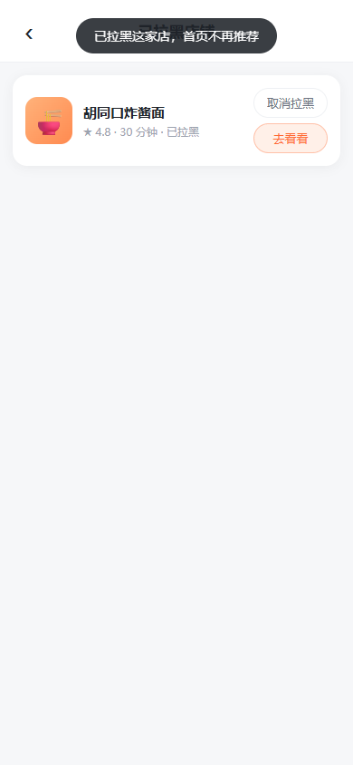

- 展示全部拉黑店铺，可「取消拉黑」或「去看看」；
- 空态有引导文案。

## 14-15 这一顿忌口

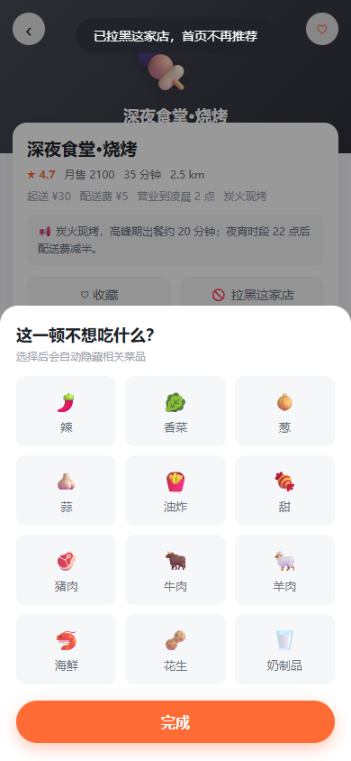
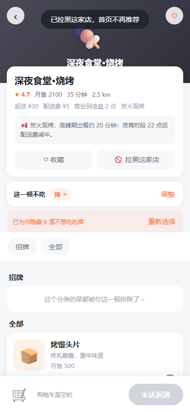

- 12 种忌口：辣、香菜、葱、蒜、油炸、甜、猪肉、牛肉、羊肉、海鲜、花生、奶制品；
- 选中后菜单自动隐藏命中菜品，并提示「已为你隐藏 N 道不想吃的菜」；
- 结算时自动写入订单备注，商家可见。

## 16 主题色

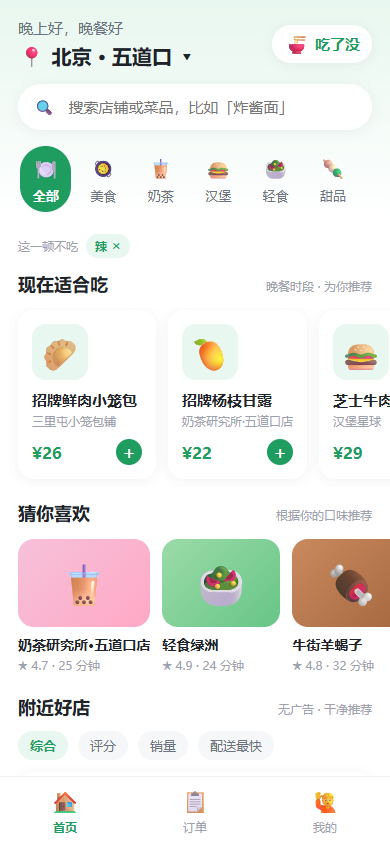

- 6 套方案：活力橙（默认）/ 番茄红 / 抹茶绿 / 海盐蓝 / 葡萄紫 / 莓果粉；
- 通过 CSS 变量驱动，全站（按钮、徽标、渐变、状态）实时联动；
- 浏览器标签栏主题色同步，选择持久化。

---

## 主流程串联

```text
首页 → 店铺详情 → 加购 → 结算 → 模拟支付 → 配送跟踪 → 已送达 → 订单 → 再来一单
```

## 设计规范摘要

- 视觉：白底 + 暖橙主色、圆角卡片、大字号、零广告零弹窗；
- 布局：移动优先（390px），桌面浏览器居中显示手机样式；
- 反馈：加购/收藏/拉黑等操作均有 Toast 即时反馈；
- 安全：删除、清空类操作一律二次确认；演示能力明确标注。
